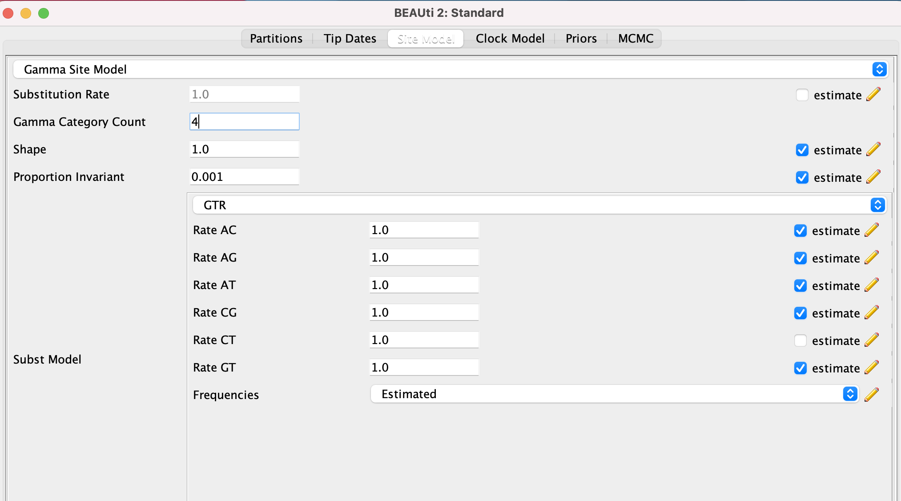
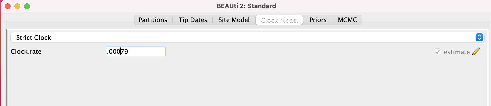
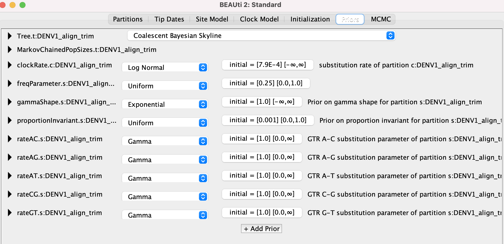

# cambodia-dengue-national

This repo contains directions and scripts for our Cambodia dengue paper, which can be accessed as a preprint at Brook et al. 2022. All final figures can be accessed in the "final-figures" folder, and all data used to generate them can be accessed in the "data" subfolder. Within the "figure-development" folder, you will additionally find subfolders corresponding to each figure ("Fig1", "Fig2", "Fig3", "Fig4", "Fig5") in the manuscript which contain the scripts used to (a) generate any data included in the folder and (b) actually produce the figure itself.

Below, you will find detailed directions of the broad workflow used in the  preparation of our Bayesian timetrees in Figure .

---

## Workflow to Generate Bayesian Timetrees

---

### Gathering background sequences from GenBank

We first sought to supplement our existing Cambodia sequences with those available in GenBank [(NCBI Virus)](https://www.ncbi.nlm.nih.gov/labs/virus/vssi/#/). We collected full or partial genome nucleotide sequences >10000 bp in length, selecting ALL existing sequences for Cambodia already available for Dengue 1 (tax id 11053; 90 sequences) and Dengue 2 (tax id 11060; 47 sequences). We supplemented these with genomes collected from other major Southeast Asian countries (nine), which were Laos, Myanmar, Malaysia, Thailand, Vietnam, Brunei, Indonesia, the Philippines, and Singapore. All countries were represented in the DENV-1 dataset and eight of the nine (no Myanmar) in the DENV-2 dataset. To avoid overrepresenting certain countries outside of Cambodia, we limited sequence selection to a maximum of three genomes collected per year from each available year per country, beginning in 2002, the year in which we began our national time series initiated.

The subfolder, "gather-sequences", includes the original NCBI datafile used to select sequences ("allSEasiadengue.csv"), the code used to query this list and select the sequences ("query-genbank.R"), and the output file that lists the accession number, genotype, date, and country of origin for all sequences beyond those generated in our own sampling, which are used in this paper ("All_Seq_SE_Asia.csv"). The subfolder also includes two text files used to download these sequences as a batch .fasta file from GenBank ("DENV1-NCBI.txt" and "DENV2-NCBI.txt"), as well as the resulting .fasta batch files from those downloads ("GenBankDENV1.fasta" and "GenBankDENV1.fasta").

---

### Including our own sequences

We additionally generated our own sequences for this analysis which have been recently submitted to GenBank (DENV1: accession numbers OK159935-OK159976, OL411495-OL411499, and OL412140, OL412678, and OL412703; DENV2: OL414717-OL414765, OL412740, OL420733 and OL435143; DENV4:  MZ976858-MZ976860). To generate these sequences, we (a) performed metagenomic Next Generation Sequencing on samples from patients reporting to clinic with undiagnosed fevers, then ran them through the [CZID](czid.org) pipeline to query the origin of each fever. For all samples positive for dengue, which generated reliable contigs in the metagenomic pipeline, we then sought to generate consensus genomes using the [ARTIC network's Nextflow consensus genome pipeline](https://github.com/connor-lab/ncov2019-artic-nf), mapping each sequence to the closest GenBank accession number hit in the original metagenomic run of IDseq, using a cutoff of 10 reads per nucleotide site to make a consensus call (sites with <10 reads were called as "N").

Using this method, we generated 50 full genome sequences of DENV-1 and 51 full genome sequences of DENV-2, which can be found in the sub-folder "contributed-sequences" as the files "allDENV1_NIH.fasta" and "allDENV2_NIH.fasta". Sequences were verified visually by comparing raw reads to consensus genomes in Geneious, as well as by checking their congruence with conensus genomes using a similar approach to the Nextflow pipeline implemented in IDseq.

Using the script "genome-quality-check.R", we further verified the quality of each genome. All contributed genomes were >10000 bps in length and a maximum of 90 Ns (corresponding to <1% of the dengue virus genome). The output of this curation check can be viewed as a .csv file in the folder ("genome_quality_check.csv"). We additionally contributed three DENV-4 genomes ("allDENV4_NIH.fasta") to GenBank (accession number MZ976858-MZ976860), though data were too sparse to analyze in earnest.

---

### Alignment and model selection

We include the combined files of both NIH and background SE Asian sequences from GenBank in the subfolder "alignment" as files "allDENV1_combined.fasta" and "allDENV2_combined.fasta". Sequence headers were renamed to be compatible with BEAST (from the original files, "allDENV1_combined_prename.fasta"), such that the date of each sequence could be easily discerned after the underscore ("_") in each title. These were then sent to [MAFFT](https://mafft.cbrc.jp/alignment/server/) for alignment, prior to tree-building in BEAST.

After alignment, we evaluated the optimal nucleotide substitution model for each set of genomes, using [ModelTest-NG](https://github.com/ddarriba/modeltest). Output files from both DENV-1 and DENV-2 runs of ModelTest-NG are available for viewing in the subfolder, "modeltest-ng-output." Both found the strongest support (AIC and AICc) for GTR+I+G4 nucleotide substitution models. 

---

### Building a phylogenetic tree using BEAST2

The BEAST and BEAST2 community mains a number of extremely helpful tutorials that you should practice to get BEAST up and running on your home computer. See [here](https://taming-the-beast.org/tutorials/). 

After model selection, we next built a Bayesian phylogenetic tree for each set of dengue genomes in BEAST2, using the GTR+I+G4 nucleotide substitution model recommended by ModelTest-NG. The first step in this process requires generation of a .xml file for input into BEAST, using the program BEAUti. (Note: The GTR+I+G4 substitution model is easily specified in BEAUti; however, for less common forms, see this great blog post [here](https://justinbagley.rbind.io/2016/10/11/setting-dna-substitution-models-beast/). Additionally, it is possible to generate .xml files outside of BEAUti, for example in a pipeline scenario, though this approach was not needed for this phylogeny).

To prepare the .xml file, we used the following parameters in tab inputs at the top of the screen in BEAUti:
 - Tip Dates: We used the date of sample collection as the "Tip Date." For any sample from GenBank which only listed year of collection, we set the tip date to July 31 of the year of collection. Each alignment was uploaded to BEAUti with sequence names arranged so as to easily decipher the date.
 - Site Model: Following output from ModelTest-NG, we selected a "Gamma Site Model" with Gamma category 4 and an estimated 0.001 for the proportion invariant. The exact parameter entries can be seen here:
 

- **Clock Model**: After [Salje et al. 2017](https://science.sciencemag.org/content/355/6331/1302.abstract), we adopted a strict molecular clock. Similar coalescent times were observed with relaxed clock models as well. We set the clock rate at 7.9 x 10^-4 substitutions/site/year, the median reported value in [Sall et al. 2020](https://journals.asm.org/doi/full/10.1128/JVI.01738-09).

- **Priors**: We used a Coalescent Bayesian Skyline model. Nucleotide substitution rates were left at default, assuming a Gamma distribution, Alpha=0.05, Beta=10, initial value of 1, spanning a range of 0 to infinity. The following table specifies all other priors (Offset = 0 and Miniordimension= 1 for all priors):

| Prior  | Distribution  | Parameter 1  | Parameter 2  | Mean In Real Space |  Initial Value | Lower | Upper | Dimension | Estimate
|---|---|---|---|---|---|---|---|---|---|
| bPopSizes  |  -- | --  |  -- |--   | 380  |0 |  -- | 1  | check |
| clockRate  |  logNormal | 0.001  |  1.25 |check   | 0  |-- |  -- | 1  | check |
| freqParameter  | Uniform   | 0  | 1  | --  | 0.25  | 0  | 1  |  4  |check |
| gammaShape  | exponential  | 1  | --  | --  | 1  |  -- |  -- |  1 | check  |
| proportionInvariant  | Uniform  |  0 |  1 | --  |  0.001 | 0  |  1 | 1  | check |

The prior entry page can be seen here:

- **MCMC**: We used an MCMC chain length of 100,000,000 iterations and set tracelog and treelog every 10,000 iterations. All other MCMC metrics were left at default. 

---

### Visualizing Bayesian timetree

The initial 10% of MCMC iterations were removed as burn-in. Parameter convergence was assessed visually using Tracer v1.6. Once verified, we used TreeAnnotator to average across the BEAST tree output, then visualized the resulting tree in R. Scripts for preparation of the timetree witnessed in our paper are available in folder "Figures" and subfolders "Fig1" and "Fig3". 
